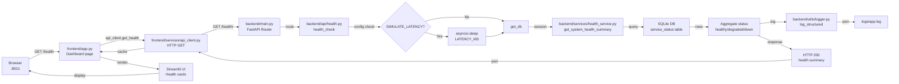

# Internal Ops Dashboard

A lightweight internal engineering operations dashboard — built as the **monitored target system** for an Agentic ITSM platform.

## What this is

This is NOT a production SaaS product. It's a realistic-feeling internal ops tool designed to:

- experience failures
- expose operational metrics
- generate incidents  
- contain deployment bugs
- provide meaningful debugging context for AI-driven ITSM workflows

## Stack

| Layer | Tech |
|---|---|
| Frontend | Streamlit |
| Backend API | FastAPI |
| Database | SQLite (via SQLAlchemy) |
| CI | GitHub Actions |
| Container | Docker / docker-compose |

## Quick start (local)

```bash
# Install deps
pip install -r requirements.txt

# Start backend (from repo root)
uvicorn backend.main:app --reload

# Start frontend (new terminal)
streamlit run frontend/app.py
```

Backend: http://localhost:8000  
API Docs: http://localhost:8000/docs  
Dashboard: http://localhost:8501

## Docker

```bash
mkdir -p logs data
docker compose up --build
```

## Failure simulation

Flip env vars to inject failures for ITSM testing:

| Variable | Default | Effect |
|---|---|---|
| `SIMULATE_LATENCY` | `false` | Adds artificial delay to all responses |
| `SIMULATE_FAILURES` | `false` | Randomly fails requests at `FAILURE_RATE` probability |
| `LATENCY_MS` | `2000` | Delay in ms when latency simulation is on |
| `FAILURE_RATE` | `0.3` | 0.0–1.0 probability of failure |

Or hit the dedicated simulation endpoints directly:

GET /simulate/latency?ms=5000   # artificial delay
GET /simulate/crash             # forced 500
GET /simulate/timeout           # never responds
GET /simulate/bad-json          # malformed response
POST /auth/simulate-failure     # break auth service
PATCH /health/services/{name}?status=down   # force a service down

## API overview

| Endpoint | Purpose |
|---|---|
| `GET /health/` | System health summary |
| `GET /health/services` | Per-service status |
| `GET /incidents/` | Incident list |
| `POST /incidents/` | Create incident |
| `PATCH /incidents/{id}` | Update incident |
| `GET /deployments/` | Deployment history |
| `POST /deployments/` | Trigger deployment |
| `GET /metrics/` | Current metrics |
| `GET /metrics/history` | Historical metrics |
| `GET /logs/` | Log viewer |
| `POST /auth/token` | Get auth token |

## Running tests

```bash
pytest tests/ -v
```

## Logs

Structured logs written to `logs/`:
- `logs/app.log` — API request + app events
- `logs/incidents.log` — Incident lifecycle events
- `logs/deployment.log` — Deployment events

All log lines use the format:  
`TIMESTAMP | logger | LEVEL | {json_payload}`

__init__.py files needed
Create empty __init__.py files at each of these paths:

backend/__init__.py
backend/api/__init__.py
backend/services/__init__.py
backend/db/__init__.py
backend/middleware/__init__.py
backend/utils/__init__.py
backend/mock_data/__init__.py
frontend/__init__.py
frontend/pages/__init__.py
frontend/components/__init__.py
frontend/services/__init__.py
frontend/utils/__init__.py
tests/__init__.py

All empty — just needed for Python package resolution when running uvicorn backend.main:app from the repo root.

## How to run it
bash

# 1. Clone / create repo, install deps
pip install -r requirements.txt

# 2. Create log dirs
mkdir -p logs data

# 3. Start backend (seeds DB on first run)
uvicorn backend.main:app --reload --port 8000

# 4. Start frontend (new terminal)
streamlit run frontend/app.py

# 5. Run tests
pytest tests/ -v
Backend docs: http://localhost:8000/docs
Dashboard: http://localhost:8501

I'll analyze the repository structure and trace request flows through the codebase. Let me start by exploring the repository.Now let me explore the directory structure more deeply:I see the repository is private. Let me try accessing the files directly:Let me get the file listing in a more structured way:Now let me get the actual code files to understand the request flow better:Now let me get more details on the key files to understand the flow better:Now I have enough information to create a comprehensive analysis. Let me create the visualizations and documentation:

## Repository Structure & Request Flow Analysis

I've analyzed your codebase thoroughly. Here's a complete breakdown:

---

## 📁 Repository Structure

```
ITServiceManagement-MAS/
├── internal-ops-dashboard/          ← Monitored target system (FastAPI + Streamlit)
│   ├── backend/
│   │   ├── main.py                  # FastAPI app, lifespan hook, routers
│   │   ├── api/                     # Route handlers
│   │   │   ├── health.py            # Health checks, service status
│   │   │   ├── incidents.py         # CRUD incidents
│   │   │   ├── deployments.py       # Deployment history
│   │   │   ├── metrics.py           # Real-time metrics
│   │   │   ├── auth.py              # Token validation
│   │   │   └── logs.py              # Log viewer
│   │   ├── services/                # Business logic
│   │   │   ├── health_service.py    # Health aggregation
│   │   │   ├── incident_service.py  # Incident CRUD
│   │   │   ├── deployment_service.py
│   │   │   ├── metric_service.py
│   │   │   └── auth_service.py
│   │   ├── db/
│   │   │   ├── database.py          # SQLAlchemy engine
│   │   │   ├── models.py            # 4 tables: incidents, deployments, service_status, metric_snapshots
│   │   │   └── seed.py              # Bootstrap data (5 services, 5 deployments, 5 incidents)
│   │   ├── middleware/
│   │   │   └── request_logger.py    # Structured HTTP logging
│   │   └── utils/
│   │       ├── config.py            # Env-driven config (failure injection flags)
│   │       └── logger.py            # JSON structured logging
│   │
│   ├── frontend/                    # Streamlit UI
│   │   ├── app.py                   # Entry point, sidebar router
│   │   ├── pages/                   # 5 dashboard pages
│   │   │   ├── dashboard.py         # System overview
│   │   │   ├── incidents.py         # Incident management
│   │   │   ├── deployments.py       # Deployment history
│   │   │   ├── metrics.py           # Time-series metrics
│   │   │   └── logs.py              # Log viewer
│   │   ├── components/
│   │   │   ├── navbar.py
│   │   │   ├── alert_banner.py
│   │   │   ├── status_cards.py
│   │   │   └── log_viewer.py
│   │   ├── services/
│   │   │   └── api_client.py        # HTTP client to backend
│   │   └── utils/
│   │       └── formatting.py
│   │
│   ├── tests/                       # pytest suite
│   ├── logs/                        # app.log, incidents.log, deployment.log
│   └── Dockerfile.{backend,frontend}
│
├── agentic-itsm/                    ← AI-driven incident management platform
│   ├── agents/                      # 11 agents (deterministic + LLM hybrid)
│   │   ├── monitoring_agent.py      # Polls health, detects anomalies
│   │   ├── classification_agent.py  # LLM: severity + incident type
│   │   ├── rca_agent.py             # LLM: root cause analysis
│   │   ├── risk_scoring_agent.py    # Risk score: 0.0–1.0
│   │   ├── escalation_agent.py      # 7 escalation rules
│   │   ├── human_review_agent.py    # Pause workflow for human
│   │   ├── remediation_agent.py     # Execute low-risk fixes
│   │   ├── recovery_validation_agent.py  # Stability window (5 min)
│   │   ├── resolution_agent.py      # Close incident
│   │   ├── github_agent.py          # Create issue, manage board
│   │   └── notification_agent.py    # Email notifications
│   │
│   ├── workflows/
│   │   ├── incident_workflow.py     # LangGraph: 11-node state machine
│   │   └── monitoring_loop.py       # Continuous polling loop
│   │
│   ├── state/
│   │   ├── incident_state.py        # TypedDict with 30+ fields
│   │   ├── persistent_store.py      # SQLite CRUD
│   │   └── checkpoint_store.py      # LangGraph checkpointing
│   │
│   ├── remediation/
│   │   ├── auth_remediation.py
│   │   ├── latency_remediation.py
│   │   ├── service_restart.py
│   │   ├── deployment_remediation.py
│   │   └── recovery_validator.py
│   │
│   ├── services/
│   │   ├── monitoring_service.py    # HTTP polling + anomaly detection
│   │   ├── llm_service.py           # OpenAI wrapper
│   │   ├── github_service.py        # REST + GraphQL
│   │   ├── gmail_service.py         # Email notifications
│   │   └── deployment_service.py    # Deployment correlation
│   │
│   ├── dashboard/
│   │   ├── app.py                   # Streamlit entry (AI Command Center)
│   │   ├── pages/
│   │   │   ├── live_incidents.py
│   │   │   ├── execution_trace.py
│   │   │   ├── failure_injection.py
│   │   │   ├── ai_reasoning.py
│   │   │   ├── human_review_queue.py
│   │   │   ├── live_logs.py
│   │   │   ├── github_activity.py
│   │   │   ├── system_health.py
│   │   │   └── remediation_status.py
│   │   ├── components/
│   │   │   ├── timeline.py
│   │   │   ├── workflow_graph.py
│   │   │   ├── incident_card.py
│   │   │   └── agent_status.py
│   │   └── services/
│   │       └── dashboard_api.py
│   │
│   ├── app.py                       # Entry point (modes: --loop, --simulate, --dashboard)
│   └── requirements.txt
│
├── docker-compose.yml               # Multi-container orchestration
├── INSTRUCTIONS.md                  # Quick start guide
└── README.md
```

---

## 🔄 Request Flow Examples (4 Scenarios with Mermaid Diagrams)

### **Example 1: Dashboard Health Check → Service Status Update**



**Key Files:**
- `frontend/pages/dashboard.py:19` → calls `get_health()`
- `frontend/services/api_client.py` → HTTP client
- `backend/api/health.py:20-31` → endpoint handler
- `backend/services/health_service.py` → queries DB
- `backend/utils/config.py` → reads `SIMULATE_LATENCY`, `FAILURE_RATE`

---

### **Example 2: Create Incident via Dashboard → API Storage**

```mermaid
graph LR
    A["Browser<br/>:8501"] -->|Click 'Create Incident'| B["frontend/pages/incidents.py<br/>create form"]
    B -->|User fills form| C["title, severity<br/>affected_service, notes"]
    C -->|Click Submit| D["frontend/services/api_client.py<br/>POST /incidents/"]
    D -->|POST| E["backend/main.py<br/>FastAPI"]
    E -->|route| F["backend/api/incidents.py<br/>create_new_incident"]
    F -->|validate| G["CreateIncidentRequest<br/>Pydantic model"]
    G -->|pass| H["backend/services/incident_service.py<br/>create_incident"]
    H -->|ORM| I["SQLAlchemy Session<br/>Incident model"]
    I -->|INSERT| J["SQLite DB<br/>incidents table"]
    J -->|id| K["log_structured<br/>incidents.log"]
    K -->|json event| L["logs/incidents.log"]
    J -->|new row| M["HTTP 201<br/>incident dict"]
    M -->|json| D
    D -->|response| B
    B -->|refresh| N["Streamlit UI<br/>Incidents list"]
    N -->|display| A
```



**Key Files:**
- `frontend/pages/incidents.py` → form and submission
- `backend/api/incidents.py:47-56` → POST handler
- `backend/services/incident_service.py` → business logic
- `backend/db/models.py` → SQLAlchemy Incident model
- `backend/utils/logger.py` → writes to `logs/incidents.log`

---

### **Example 3: Agentic ITSM — Auth Failure Detection → Remediation**

```mermaid
graph TD
    A["app.py --loop<br/>Monitoring loop"] -->|every 30s| B["monitoring_loop.py<br/>_run_detection_tick"]
    B -->|fetch_health| C["services/monitoring_service.py<br/>fetch_health"]
    C -->|GET /health| D["ops dashboard<br/>:8000"]
    D -->|health status| E["Anomaly Detection<br/>detect_anomalies"]
    E -->|auth-service DOWN| F["anomalies list<br/>auth_failure"]
    
    F -->|launch| G["workflows/incident_workflow.py<br/>run_incident_workflow"]
    G -->|LangGraph| H["agents/monitoring_agent.py<br/>node: monitor"]
    H -->|anomalies list| I["agents/classification_agent.py<br/>node: classify"]
    I -->|LLM gpt-4o-mini| J["OpenAI API<br/>classify_incident"]
    J -->|severity=P1<br/>type=Authentication| K["state update"]
    
    K -->|flow| L["agents/rca_agent.py<br/>node: rca"]
    L -->|correlate deployment| M["services/deployment_service.py<br/>fetch_deployments"]
    M -->|recent failed deploy| N["RCA reasoning<br/>root_cause_summary"]
    
    N -->|flow| O["agents/risk_scoring_agent.py<br/>node: score_risk"]
    O -->|P1 + auth + risk=0.95| P["escalation_required=True"]
    
    P -->|flow| Q["agents/escalation_agent.py<br/>node: escalate"]
    Q -->|7 rules check| R["Escalate to human"]
    
    R -->|flow| S["agents/github_agent.py<br/>node: github_ops"]
    S -->|create issue| T["GitHub Issue #42<br/>Agentic ITSM repo"]
    S -->|move card| U["Project board<br/>New → Triage"]
    
    U -->|flow| V["agents/notification_agent.py<br/>stage: Triage Started"]
    V -->|HTML email| W["ESCALATION_EMAIL<br/>Gmail SMTP"]
    
    W -->|pause workflow| X["state persist<br/>lifecycle_stage='awaiting_review'"]
    X -->|store| Y["SQLite agentic_itsm.db<br/>incidents table"]
    
    Y -->|human approval| Z["agentic-itsm Dashboard<br/>Human Review Queue"]
    Z -->|approve| AA["resume_incident_workflow"]
    AA -->|flow| AB["agents/remediation_agent.py<br/>node: remediate"]
    AB -->|strategy=reset_auth| AC["remediation/auth_remediation.py"]
    AC -->|PATCH /health/services/auth-service| AD["ops dashboard<br/>auth-service → healthy"]
    AD -->|recovery check| AE["agents/recovery_validation_agent.py<br/>5-min stability window"]
    AE -->|3 clean checks| AF["recovery_validated=True"]
    AF -->|resolve| AG["agents/resolution_agent.py"]
    AG -->|close GitHub issue| AH["GitHub Issue → Closed"]
    AH -->|final email| AI["Incident Resolved<br/>Green banner"]
```



**Key Files:**
- `app.py:54-65` → entry point, `--loop` mode
- `workflows/monitoring_loop.py:65-93` → detection tick
- `services/monitoring_service.py` → HTTP polling + anomaly detection
- `workflows/incident_workflow.py:174-252` → LangGraph state machine
- `agents/classification_agent.py` → LLM classification
- `agents/escalation_agent.py` → 7 escalation rules
- `agents/remediation_agent.py:125-143` → dispatch remediation
- `remediation/auth_remediation.py` → PATCH auth-service
- `agents/recovery_validation_agent.py:20-90` → stability window validation
- `agents/resolution_agent.py` → close issue
- `state/persistent_store.py` → SQLite upsert

---

### **Example 4: Streamlit Failure Injection → Full Lifecycle**


**Key Files:**
- `dashboard/pages/failure_injection.py` → UI buttons
- `workflows/monitoring_loop.py:226-258` → `launch_incident` with DB lock
- `integrations/internal_ops/simulation_client.py` → failure injection API calls
- `state/persistent_store.py` → DB-backed locking, upsert
- `agents/remediation_agent.py` → dispatch strategy
- `remediation/*.py` → concrete remediation modules
- `agents/recovery_validation_agent.py` → stability window

---

## 📋 What Each Code File Does

### **Internal Ops Dashboard (Backend)**

| File | Purpose |
|------|---------|
| `backend/main.py` | FastAPI app initialization, lifespan hook (DB seed), CORS, routers, failure simulation endpoints |
| `backend/api/health.py` | `/health/`, `/health/services`, `/health/services/{name}`, PATCH service status |
| `backend/api/incidents.py` | `/incidents/` GET/POST, `/{id}` GET/PATCH |
| `backend/api/deployments.py` | `/deployments/` GET/POST, `/{id}` GET/PATCH |
| `backend/api/metrics.py` | `/metrics/` current, `/metrics/history` time-series |
| `backend/api/auth.py` | `/auth/token`, `/auth/validate`, failure simulation |
| `backend/api/logs.py` | `/logs/` with log_type, lines, since_minutes filters |
| `backend/services/health_service.py` | `get_system_health_summary`, `get_all_service_statuses`, `update_service_status` |
| `backend/services/incident_service.py` | `create_incident`, `get_incident(s)`, `update_incident` |
| `backend/services/deployment_service.py` | Deployment CRUD |
| `backend/db/database.py` | SQLAlchemy engine, `get_db()` session factory |
| `backend/db/models.py` | 4 SQLAlchemy models: Incident, Deployment, ServiceStatus, MetricSnapshot |
| `backend/db/seed.py` | Bootstrap 5 services, 5 deployments, 5 incidents, 24 metric snapshots |
| `backend/middleware/request_logger.py` | JSON logging for every HTTP request |
| `backend/utils/config.py` | Env-driven config (failure flags, DB path, API port) |
| `backend/utils/logger.py` | `log_structured()` JSON logger |

### **Internal Ops Dashboard (Frontend)**

| File | Purpose |
|------|---------|
| `frontend/app.py` | Streamlit entry, sidebar router to 5 pages |
| `frontend/pages/dashboard.py` | System health, service cards, active incidents, latest deployment |
| `frontend/pages/incidents.py` | List with status filter, create form, inline update |
| `frontend/pages/deployments.py` | Deployment history, manual trigger form |
| `frontend/pages/metrics.py` | 6 metric cards, 3 time-series charts (latency, error, throughput) |
| `frontend/pages/logs.py` | Multi-stream log viewer (app, incidents, deployment logs) |
| `frontend/services/api_client.py` | HTTP client: `get_health()`, `get_incidents()`, `post_incident()`, etc. |
| `frontend/components/navbar.py` | Header branding |
| `frontend/components/alert_banner.py` | Red alert if open critical incidents |
| `frontend/components/status_cards.py` | 5 service health cards |
| `frontend/utils/formatting.py` | `format_status()`, `time_since()` helpers |

### **Agentic ITSM (Agents)**

| File | Purpose |
|------|---------|
| `agents/monitoring_agent.py` | Polls ops dashboard, calls `detect_anomalies()`, populates state["anomalies"] |
| `agents/classification_agent.py` | Uses `llm_service.classify_incident()` (LLM or deterministic fallback); sets severity, incident_type, ai_confidence |
| `agents/rca_agent.py` | LLM root-cause analysis; correlates with deployments; sets root_cause_summary, correlated_deployment |
| `agents/risk_scoring_agent.py` | Deterministic risk scoring (0.0–1.0); picks remediation_strategy |
| `agents/escalation_agent.py` | 7 deterministic rules; sets escalation_required, escalation_reasons |
| `agents/human_review_agent.py` | Pauses workflow if escalated; waits for operator approval via dashboard |
| `agents/remediation_agent.py` | Dispatches to `remediation/*.py` modules; sets remediation_attempted, remediation_succeeded |
| `agents/recovery_validation_agent.py` | Runs 5-min stability window; validates service health before resolution |
| `agents/resolution_agent.py` | Closes GitHub issue, sets lifecycle_stage='resolved' |
| `agents/github_agent.py` | Creates issue, moves project board column, posts lifecycle comments |
| `agents/notification_agent.py` | Sends stage-specific HTML emails (de-duplicated) |

### **Agentic ITSM (Workflows & State)**

| File | Purpose |
|------|---------|
| `workflows/incident_workflow.py` | LangGraph: 11-node state machine with routing conditions; compilation + invoke |
| `workflows/monitoring_loop.py` | Continuous polling loop (every 30s); detects anomalies; drives open incidents forward; DB locking |
| `state/incident_state.py` | TypedDict with 30+ fields; helpers like `new_state()`, `append_trace()` |
| `state/persistent_store.py` | SQLite CRUD: `upsert_incident()`, `get_open_incidents()`, DB-backed locks (`acquire_workflow_lock()`) |
| `state/checkpoint_store.py` | LangGraph checkpointer for resumable workflows |

### **Agentic ITSM (Remediation)**

| File | Purpose |
|------|---------|
| `remediation/auth_remediation.py` | PATCH `/health/services/auth-service?status=healthy` |
| `remediation/latency_remediation.py` | PATCH `/health/services/api-gateway?status=healthy` |
| `remediation/service_restart.py` | Simulate service restart (degraded → healthy cycle) |
| `remediation/deployment_remediation.py` | POST new rollback deployment record |
| `remediation/recovery_validator.py` | Poll health + metrics; check stability window |

### **Agentic ITSM (Services & Dashboard)**

| File | Purpose |
|------|---------|
| `services/monitoring_service.py` | HTTP polling: `fetch_health()`, `fetch_metrics()`, `fetch_logs()`, `detect_anomalies()` |
| `services/llm_service.py` | OpenAI wrapper; `classify_incident()`, `run_rca()`, fallback to deterministic logic |
| `services/github_service.py` | GitHub REST + GraphQL: create issue, move column, post comments |
| `services/gmail_service.py` | SMTP email with HTML templates, stage-based coloured banners |
| `services/deployment_service.py` | Match `commit_ref` across incidents and deployments |
| `dashboard/app.py` | Streamlit entry; 9-page AI Command Center |
| `dashboard/pages/live_incidents.py` | Real-time feed with lifecycle stage bar |
| `dashboard/pages/execution_trace.py` | 11-node pipeline diagram, agent status |
| `dashboard/pages/failure_injection.py` | 8 failure scenarios: click button → inject → workflow runs |
| `dashboard/pages/ai_reasoning.py` | Classification trace, risk score, RCA, remediation detail |
| `dashboard/pages/human_review_queue.py` | Paused incidents; approve/reject with notes |
| `dashboard/pages/live_logs.py` | Multi-stream log viewer |
| `dashboard/pages/github_activity.py` | Issues + column transitions |
| `dashboard/pages/system_health.py` | Service cards, metrics, recent deployments |
| `dashboard/pages/remediation_status.py` | Remediation attempts, recovery state |
| `dashboard/components/timeline.py` | 11-agent trace renderer |
| `dashboard/components/workflow_graph.py` | Full pipeline Mermaid diagram |
| `dashboard/services/dashboard_api.py` | All data fetch for dashboard pages |

### **Entry Points**

| File | Purpose |
|------|---------|
| `app.py --loop` | Continuous monitoring loop (polls every 30s) |
| `app.py --once` | Single detection + incident refresh cycle |
| `app.py --simulate` | Inject failure, then run once |
| `app.py --dashboard` | Launch Streamlit dashboard (:8502) |
| `app.py --api` | Launch FastAPI SSE sidecar (:8503) |

---

## 🎯 Summary

The system is built as a **hybrid AI-driven ITSM platform**:

1. **Internal Ops Dashboard** (`:8000` API + `:8501` UI) → realistic-feeling monitored system with deliberate failure hooks
2. **Agentic ITSM** (`:8502` dashboard + background loop) → continuous monitoring + 11-agent LangGraph workflow
3. **Request flow**: Dashboard → API → DB ↔ Agentic system → Polling/detection → Workflow invocation → Remediation → Recovery validation → Resolution

All flows are stateful, resumable, and logged at every step with full observability. The system runs 100% on SQLite + FastAPI + Streamlit + LangGraph + OpenAI (with deterministic fallbacks).
